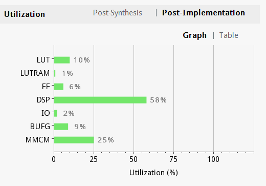
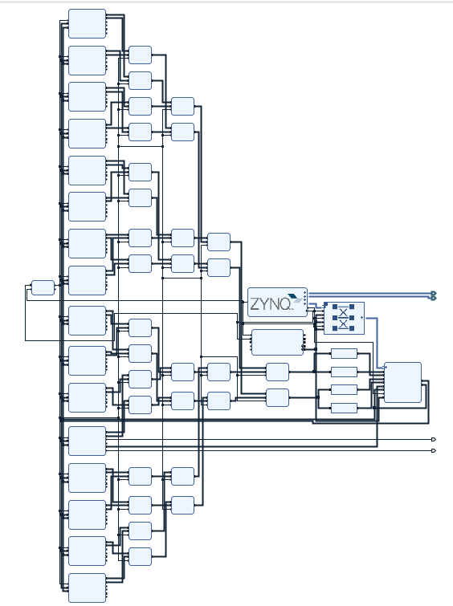

## mcPi test

---

### CPU (i7-8550u Linux)

0xffffffff points

gcc -O3

55.03s total(using `time`)

---

(old)

FPGA 100Mhz clock

one result per three clocks

2min 8s(rough timer)

---

(new)

### FPGA (ZYNQ 020 on board PYNQ-Z1)

refined design

50Mhz clock, one result per one clock

- timing requirement not meet when 60Mhz clock

1min 26s(rough +=~2s)

16 processing IPs

0xffffffff points per core

```
>>> 4 * (0xc90fdb38f / (0xffffffff * 16))
3.1415927947712112
>>> 0xc90fdb38f + 0x36f024c61 == 0xffffffff * 16
True
>>> 

```

**Utilization**

- maximum ~32 cores expected, speed may double 



**Block Design**

- You can see (left to right) clocking wizard, 16 mc_top calculation core, adders, ZYNQ ps,  AXI interconnect, custom AXI IP, outputs LED indicators)



## Speed Comparison

| Arch | Clock     | Calculation Speed(0xffffffff points) | Expected Max Speed           | Price | Power comsumption |
| ---- | --------- | ------------------------------------ | ---------------------------- | ----- | ----------------- |
| CPU  | 1.8G-4.0G | **1core:**55s                        | **8core:**55s/8=6.9s         | ~$400 | TDP 23W(Max 42W)  |
| FPGA | 50M       | **16core:**1min26s/16=5.4s           | **32core:**1min26s/32 = 2.7s | $199  | 1.62W             |
|      |           | 10x speedup                          | 2.6x speedup                 |       |                   |


