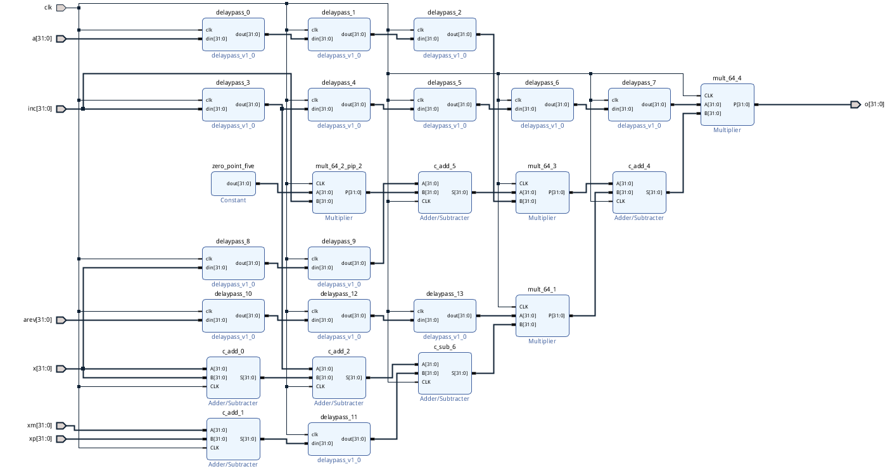
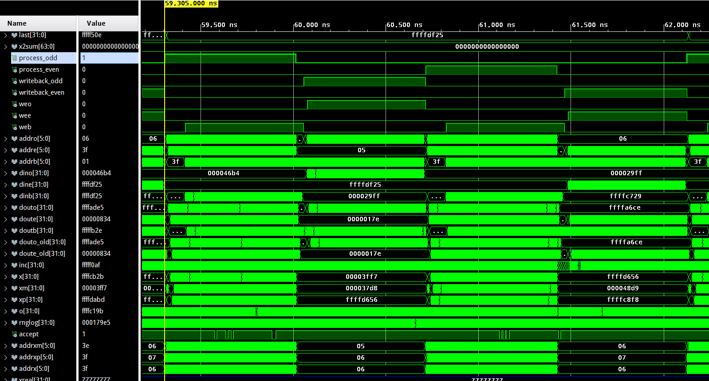
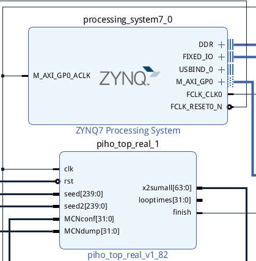
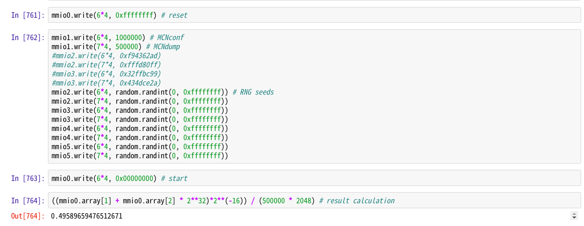
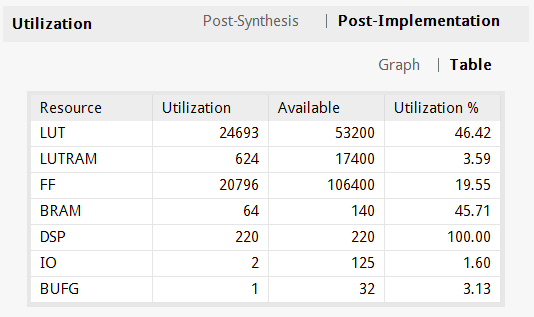
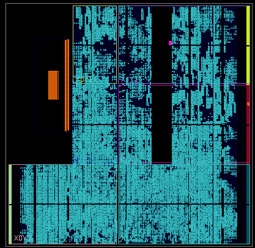

## FPGA加速的路径积分蒙特卡罗模拟

## FPGA Accelerated Path Integral Monte Carlo Simulation

2019年秋季学期计算物理A课程作业

古宜民 PB17000002

2020.2

### 简介

蒙特卡罗（MC）方法在计算物理中应用广泛，在复杂积分的计算、统计力学模拟等多方面有不可取代的地位。而为了提高计算精度而增加模拟步数N时，蒙特卡罗方法的误差随N的增加以$\frac1{\sqrt N}$速度收敛，这表明需要平方量级的算力（或运算时间）才能达到线性的精度提高。如果能够通过优化程序或使用异构计算等方法提高计算速度，则可以对蒙特卡罗方法的实现提供很大帮助。本文在现场可编程逻辑门阵列（FPGA）上实现路径积分蒙特卡罗模拟谐振子，并求得基态能量，获得了相比高度优化的CPU程序7倍的性能提升，证明了FPGA在这一类蒙特卡罗模拟中有带来巨大性能提升的潜力。

关键词：蒙特卡罗 路径积分 FPGA 高性能计算

### 路径积分蒙特卡罗理论

量子力学的路径积分表述为：

$\langle x_N,t_N|x_1,t_1\rangle = \int D[x(t)]e^{\frac i{\hbar}S}$

其中$S=\int_{x_1}^{x_N}Ldt$为系统的作用量。

选取虚时间$\tau=it$，

$\langle x_N,\tau_N|x_1,\tau_1\rangle = \int D[x(\tau)]e^{-\frac 1{\hbar}\int Ed\tau}$

其中$E=\frac{m}{2}\left(\frac{d x}{d \tau}\right)^{2}+V(x)$为变换后的系统拉氏量。

而可观测量的期望值为$<\mathcal{O}>=\frac1 Z\int D[x(t)] \mathcal{O}[x] e^{-S[x] / \hbar}$，其中Z为归一化系数。

对于谐振子，$V(x)=\frac12m\omega^2x^2$.

由于从开始到结束有无穷多条路径，但不同的路径权重不同，只有接近经典路径的路径有较大权重。于是可以使用蒙特卡罗方法，对路径进行Metropolis重要抽样形成马尔科夫链，再通过这些抽样路径计算待求物理量的期望值。

在计算机模拟时，需要离散化时间，即取时间格距为a，一个状态为$\{x_1, x_2, ..., x_N\}$。再取无量纲长度$u_i=x_i/\sqrt{\hbar / m \omega}$，作用量为：

$\frac{S}{\hbar}=\sum_{n=0}^{N-1}\left(\frac{\left(u_{n+1}-u_{n}\right)^{2}}{2 a \omega}+\frac{a \omega\left(u_{n+1}^{2}+u_{n}^{2}\right)}{4}\right)$

而在马尔科夫链中，对状态进行小扰动（如改变其中一个x值），接受新状态的概率为：

$P=min(e^{-\Delta S(x)}, 1)$.

如果马尔科夫链的初始状态（通常选为全0）包含各个激发态，随着虚时间演化，各个态随时间以$e^{-E\tau}$演化，激发态占比$e^{-(E_2-E_1)\tau}$会指数衰减，最终只剩下基态成分，进而可以求出基态的能量以及其他可观测量。

对于谐振子，由Viral定理得知其势能与动能平均值相同，则其基态能量为$E_{0}=m \omega^{2}<x^{2}>$，对应理论值$<u^{2}>=0.5$.

如果考虑马尔科夫链演化过程中激发态占比（即对应系统平均能量）的指数衰减速度，可以进而求得第一激发态能量。

### FPGA硬件设计

考虑到成本与开发难度，选择了入门级的Digilent PYNQ-Z1作为开发板，其搭载Xilinx ZYNQ-7020芯片xc7z020-1。此FPGA芯片包含双核ARM Cortex A9处理器（PS）和85K逻辑单元、4.9Mb块内存（BRAM）、220个DSP的可编程逻辑（PL）。因为包含PS，并且能够使用Python进行PS端的控制和编程，使得PS/PL通信更加容易。

#### 设计思路

**计算方法**

为了提高计算速度，使用32位定点小数进行计算。高16位为整数部分，低16位为小数。个别大量求和部分增加了整数部分的位宽。

在蒙特卡罗中都需要随机数，这里使用了FPGA上实现较为简单的LFSR。随机数发生器是“异步”的，即每个周期都生成一个随机数，无论是否被使用。

在Metropolis算法中，需要进行接受概率的计算，并和0到1内的随机数比较判断。但概率计算需要涉及动辄50余周期并难以流水化的指数运算。这里使用的加速方法是不进行指数运算，而生成对数分布的随机数。将0到1内的对数值打表存于BRAM，再随机取值，可以一个周期得到一个对数随机数。

每个处理单元需要随机的位置变化和随机的对数两个随机数，共有16*2=32个随机数生成器。其种子可以在PS中指定。

在作用量计算处，首先手动简化了作用量的表达式，然后在Block Design上用加法以及乘法IP核进行实现，并插入延迟以能够实现流水线。作用量变化计算的输入为格距a、格距倒数arev(erse)（为了避免除法运算，提前算好了a的倒数）、该点位置x、相邻位置xm(inus)和xp(lus)、位置增加量inc(rease)、以及时钟clk。

作用量变化：$\Delta S = inc(inc(0.5a+\frac1a)+ax+\frac1a(2x+inc-xp-xm))$

加法和乘法器需要一个周期算出结果，一个作用量的计算总共需要6个周期。

图为该Block Design



**存储与更新策略**

由于对于离散化的一条路径，在其上一个点发生改变时，系统的作用量改变只取决于该点和它左右相邻的点。因此，路径不同部分的点可以同时互不影响地更新。于是数据结构设计为：将1024长的路径分成8份，8路同时进行处理。每一路按奇偶放在两片BRAM中（称为BRAMo(dd)与BRAMe(ven)），每片BRAM放64个值。每一轮分奇数与偶数轮流对该片BRAM上的64个值取出、进行计算、更新，并暂存到另一片BRAM（称为BRAMb(uffer)）中，完成后将BRAMb中的值写回BRAMo或BRAMe。因为（比如）在对奇数位置的值更新时，其相邻值为偶数，需要被读但不被更新。而几乎所有奇数位置的值都被更新了，所以这种存储方式和更新策略可以很好的利用资源并提高并行性。

虽然数据读写以及计算都需要不止一个时钟周期，但利用流水线，可以在大部分时间内一个周期得到结果。于是理论上一次完整的更新（MCSweep）需要奇处理-奇写回-偶处理-偶写回四个部分，共64*4=256个周期。实际结果为282个周期。

图为一个MCSweep的仿真波形。按顺序进行了process_odd, writeback_odd, process_even, writeback_even操作。



**计算结果**

PL部分编写完成后打包成IP核，并同时自制了简易的AXI MMIO IP以便使用AXI总线进行PS/PL通信。

图为最终Block Design的一部分，piho_top_real为计算部分打包的IP核，上面的是ZYNQ PS

piho_top_real的输入为：随机数种子，总迭代数MCNconf，在马尔科夫链稳定前不参与计算的迭代数MCNdump；输出为：8个单元的平方和输出，总的平方和输出，当前迭代次数，以及完成指示。输入可以由PS控制。



在计算中，选取了较为典型的参数a=0.125, inc范围-0.125~+0.125。路径长选为2048，分为16组并行计算，因为16组运算单元耗尽了所有220个DSP，并占用了一半的LUT和BRAM。

图为通过Ethernet连接开发板，通过网页端的Jupyter Notebook在PS进行Python控制。PYNQ(Python Productivity for ZYNQ)让流程方便了很多。



由于计算平方平均值较为容易，只需要每次有效迭代累加路径上的各个值即可，但计算方差以及第一激发态（需要计算关联函数）却较为困难，最好是将所有历史通过AXI DMA传输到PS DDR内存或Ethernet传输到计算机进行处理。这里只计算了程序实现简单的基态能量期望值，并未能计算误差以及第一激发态能量。

五次运算的值为：

```
0.495896
0.500199
0.493005
0.494751
0.502061
```

理论值为0.5，可见计算结果是正确的。

关于计算速度，由于流水线不深，每一时钟周期运算较多，资源占用也较多导致路径延迟很长，时钟降到62.5Mhz才能满足timing要求。282个周期一次MCSweep，速度为每个MCSweep用时4.51us。

资源占用以及布线（左上角空处为PS，其他青色为被使用的PL）如图：

可见继续增加计算单元会面临很大困难，16路并行约为最大的并行度。





### 计算速度比较

作为比较，在CPU上也实现了同样功能并高度优化的C++程序，在i7-8550U和Xeon E5-2695 v4上单核运行，二者速度差距很小。进行的优化包括使用更快的随机数xorshift、优化访存、减少过程调用、使用AVX SIMD指令同时处理8组数据、`-O3`编译开关。

结果为CPU运行速度为每个MCSweep用时35.0us，FPGA获得了7.7倍的速度提升。

而在价格、功耗等方面，FPGA也比CPU有一定优势：

| Arch | Clock                  | Calculation Speed | Price | Power comsumption |
| ---- | ---------------------- | ----------------- | --- | ----------------- |
| CPU  | Max 4.0G(i7) | 35.0us/MCS        |~$400 | TDP 15W(i7) |
| FPGA | 62.5M                  | 4.51us/MCS        |   $199  | 1.89W             |
|      |                        | 7.7x speedup      |    |                   |

### 结论&展望

本项目成功地在FPGA上实现了比CPU更快的蒙特卡罗模拟，并且证明了FPGA在路径积分这一类问题上都有加速计算的潜力，在基态能量计算、以及格点QCD等领域有应用空间。

但是硬件开发相比软件开发具有周期长、困难等问题，如果要将此种运算方法投入使用，需要打包成简单易用的库而不是计算周期改变1就要重新编写的Verilog代码。如果能用C++等高级语言编写核心作用量计算部分，通过Vivado HLS（高级综合）直接打包成IP核与其他Verilog程序配合，并能保留流水线功能，则可以在不损失性能的情况下实现较高的可扩展性和易用性。

### 参考文献&致谢&其他

[1] Y. Lin, F. Wang, X. Zheng, H. Gao, L. Zhang, Monte Carlo simulation of the Ising model on FPGA, Journal of Computational Physics, Volume 237, 2013

[2] F. Ortega-Zamorano, M. A. Montemurro, S. A. Cannas, J. M. Jerez and L. Franco, "FPGA Hardware Acceleration of Monte Carlo Simulations for the Ising Model," in IEEE Transactions on Parallel and Distributed Systems, vol. 27, no. 9, pp. 2618-2627, 1 Sept. 2016.

本项目参考了丁泽军老师的计算物理课程讲义，以及上海交通大学2019年夏季第二届数值量子场论训练营的内容。

感谢丁泽军老师的课程和讲义给本项目带来启发。

感谢[LibreLiu](https://github.com/libreliu)在硬件开发、算法等方面提供了很大帮助。

本项目所有代码可以在[Github](https://github.com/ustcpetergu/fpga-mcmc)获得。